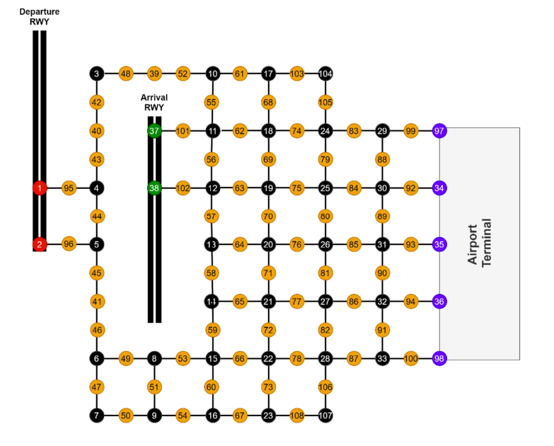

# Agent-Based Simulation of Airport Taxiing Operations
This project simulates airport taxiway operations using agent-based modelling. It compares three strategies to prevent collisions and optimize aircraft movement under different demand scenarios: prioritised, conflict-based search and distributed co-ordination.

## Problem Statement
You're given a small airport with one departure runway, one arrival runway and five terminals. The challenge is to construct and compare aircraft taxiing co-ordination solutions subject to the following constraints:
1. There are no collisions between aircraft
2. All aircraft move at the same speed
3. Aircraft are not allowed to backtrack
4. There is a maximum number of aircraft on the taxiways, determined by the demand scenario

The problem is best understood by taking a look at the grid-based airport illustrated below. 

- **Arriving aircraft** start from the arrival runway, entering the grid at nodes {37,38} and look to exit at one of the airport terminal nodes {34, 35, 36, 97, 98}.
- **Departing aircraft** start at terminals, entering the grid at nodes {34, 35, 36, 97, 98} and look to exit at the departure runway nodes {1,2}.

## Strategies
Below is a brief synopsis of how each solution strategy worked.
#### Prioritised
Prioritised planning worked in a first-come first-serve manner, meaning whichever aircraft entered first would simply plan out the shortest path (using A*) and set constraints banning subsequent aircraft from being at the same place and same time. If an aircraft spawned but no suitable path was found for it, it was rejected.

#### Conflict-Based Search (CBS)
For conflict-based search, there was no inherent priority. Instead aircraft plan their shortest routes (using A*) every time a new aircraft spawns and if a conflict is found between paths, it's added to a list of constraints and the shortest paths re-calculated until either: 
- A resolution is found → aircraft is allowed to enter the grid, all aircraft adjust their routes
- No resolution is found → aircraft is not allowed to spawn, routes remain unadjusted

#### Distributed
For the distributed strategy, the agents co-ordinated continuously by changing the weights of neighbouring nodes in order to signal nearby aircraft of their intentions. If an aircraft was within its vicinity, the weights of surrounding nodes would inform both aircraft about their plans and collisions would be avoided implicitly through co-ordination rules. The rules were based on the following pre-established protocols:
- Imposed constraints (no backtracking)
- Movement constraints from blocking out an edge once an aircraft decides they'll take it
- Implicit co-ordination via rules, like right of way at intersections. 

In real life this could be implemented by means of a radar that signals aircraft close to each other how they should proceed on the taxiways in a co-ordinated collision free way.

## Performance Indicators & Results
The following metrics were tracked under two demand scenarios normal demand (ND) and high demand (ND) in order to compare strategies:
- TTT - Total taxi time, to track how long it took the strategy to meet the quota
- ARA - Average route time per aircraft, to track how direct routes were
- MRT - Maximum route time per run, to track if some strategies consistently made some aircraft take longer routes
- MAT - Maximum algorithm calculation time, to track the worst-case scenario computing power per strategy
The simulation was run 100 times per strategy (all coefficients of variance converged within 100 trials) to get a representative picture of how each strategy performed. A comparison between strategies is shown below. Note that ‘better’ or ‘worse’ depends on the metric: lower TTT or ARA is better, while lower MAT is better

| Demand | Comparison                 | TTT               | ARA               | MRT                | MAT                |
| ------ | -------------------------- | ----------------- | ----------------- | ------------------ | ------------------ |
| ND     | Prioritised vs CBS         | No difference     | No difference     | No difference      | Prioritised better |
| ND     | Prioritised vs Distributed | Distributed worse | Distributed worse | Prioritised better | Distributed better |
| ND     | CBS vs Distributed         | Distributed worse | Distributed worse | CBS better         | Distributed better |
| HD     | Prioritised vs CBS         | No difference     | CBS worse         | No difference      | Prioritised better |
| HD     | Prioritised vs Distributed | Distributed worse | Distributed worse | Prioritised better | Distributed better |
| HD     | CBS vs Distributed         | Distributed worse | Distributed worse | CBS better         | Distributed better |

Metrics that were normally distributed were compared using pair/unpaired t-tests, while non-normal metrics were analysed using Wilcoxon Signed-Rank Tests (paired) or Vargha-Delaney A-Tests (unpaired).

### Key Takeaways
1. All strategies performed worse under high-demand conditions compared to their performance under normal demand. 
2. Prioritised and CBS performed mostly the same, with prioritised having the upper hand in ARA and MAT.
3. Distributed was less efficient in routing (higher TTT/ARA) but had lower computational cost since it avoids explicit conflict resolution

## Simulation details
A few clarifying remarks are given here about the simulation behaviour.
###### Aircraft Spawning
Aircraft are spawned as either arrival or departing aircraft with a fixed cooldown between spawns. If the number of aircraft on the runway is below the maximum, there's a 45% chance that it will spawn as arriving, a 45% chance it will spawn as departing and a 10% chance that an arriving and departing aircraft spawn simultaneously.
###### Aircraft Exiting
Once an aircraft reaches its goal state (terminal for arriving, departure runway for departing), the aircraft instantaneously leaves the grid. Of course, in reality this is not accurate as for example there's a gap between when an aircraft uses a runway to depart and when it's clear for departure again.
###### Aircraft Rejection
If an aircraft spawns but finds no possible path plan to reach its goal state from any candidate starting node, it's simply rejected from entering the grid. In reality this would correspond to delaying an arrival/departure until it is logistically suitable. 
###### Demand Scenarios
The two demand scenarios considered were nominal demand and high demand. 
For normal demand, the maximum number of aircraft on the taxiways was ≤ 5 and the simulation ran until a quota of 50 (or 51 if simultaneous spawning occurred) aircraft was met.

For high demand, the maximum number of aircraft on the taxiways was ≤ 6 and the simulation ran until a quota of 80 (or 81 if spawned simultaneously) aircraft was met. The marginal increase in the number of aircraft on the taxiways is due to the fact that the airport is small, congested and any further increase on the number simply results on a higher number of aircraft rejections.
